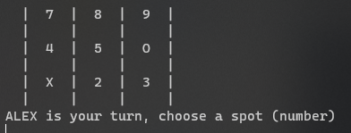
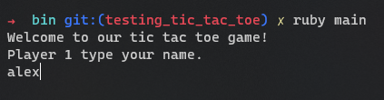

# Tic Tac Toe Game

In this repository we create a Tic Tac Toe game. This game is designed to be played on your local machine in the terminal.

Built with Ruby.

## Game Rules

- each player has to input his/her name
- then each player has a turn to choose a spot in the board(input a number)
- then it continues until we got a winner or a draw
 You can win if you complete a row, column or diagonal with your symbol as I show you in the picture down below

View of the game in the terminal.

Game graphic illustration.

## Built With

- Ruby

## Getting Started

Follow this step to get a local copy of the project and run it in your terminal

### Prerequisites

- Local machine running Linux, MacOS or Windows.
- Ruby

### Usage

Follow the instructions below in order to use this project:

Get a local copy of the repo with this command:

`git clone https://github.com/alejandrotoledoweb/tic_tac_toe_ruby.git`

Then open the project in your terminal and cd inside the `bin/` folder.

Lastly, run `ruby main` in your terminal and you will see the first instructions for the game to input the name of the player 1. Like the image.

## Run tests

- Install RSpec by typing in your terminal `gem install rspec`
- After the installation is over, just type the command `rspec` in your teminal to check the results of the tests.

## Authors

👤 Andjela Vukadinovic 

- GitHub: [@githubhandle](https://github.com/410AngelaVu)
- Twitter: [@twitterhandle](@vukadinov7)
- LinkedIn: [linkedin](https://www.linkedin.com/in/andjela-vukadinovic-67a21b1b2/)

👤  **Alejandro Toledo**
- GitHub: [@alejandrotoledoweb](https://github.com/alejandrotoledoweb)
- Twitter: [@alejot](https://twitter.com/alejot)
- LinkedIn: [Alejandro Toledo](https://www.linkedin.com/in/alejandro-toledo-3b444b109/)

## 🤝 Contributing

Contributions, issues, and feature requests are welcome!

Feel free to check the [issues page](https://github.com/alejandrotoledoweb/tic_tac_toe_ruby/issues).

## Show your support

Give a ⭐️ if you like this project!

## Acknowledgments

One of the Odin projects.